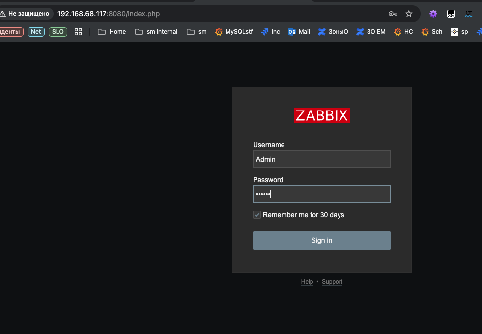
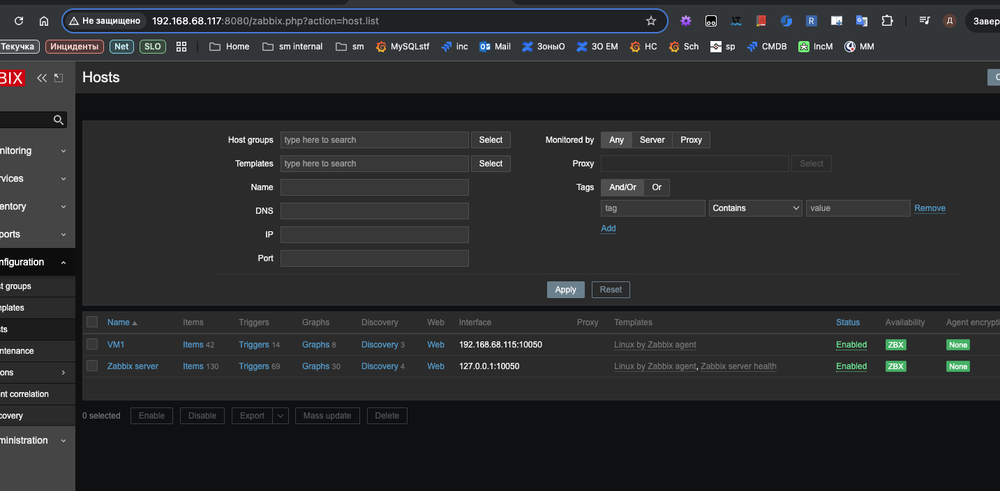
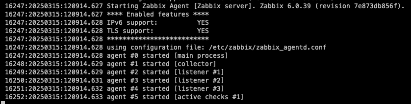
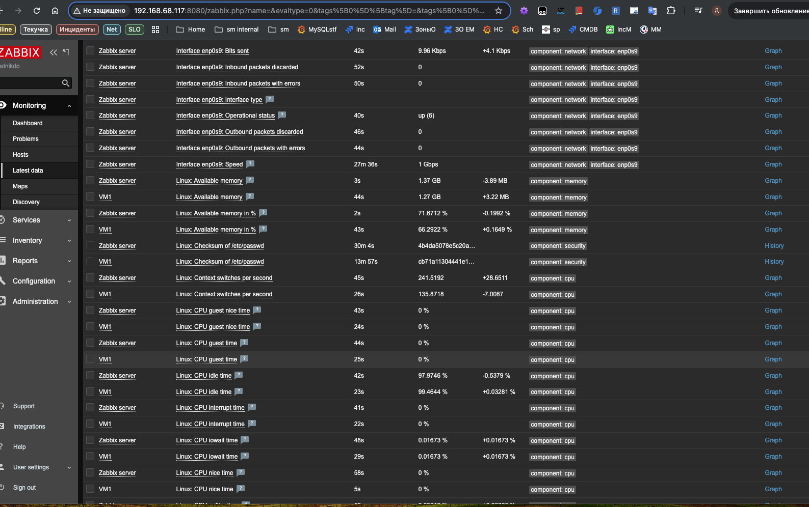

# Домашнее задание к занятию "`Система мониторинга Zabbix`" - `Бедник Денис`


---

### Задание 1 Установите Zabbix Server с веб-интерфейсом.



```bash
apt install postgresql
wget https://repo.zabbix.com/zabbix/6.0/debian/pool/main/z/zabbix-release/zabbix-release_latest_6.0+debian11_all.deb
dpkg -i zabbix-release_latest_6.0+debian11_all.deb
apt update
 apt install zabbix-server-pgsql zabbix-frontend-php php7.4-pgsql zabbix-nginx-conf zabbix-sql-scripts zabbix-agent
su - postgres -c 'psql --command "CREATE USER zabbix WITH PASSWORD '\'123456789\'';"'
su - postgres -c 'psql --command "CREATE DATABASE zabbix OWNER zabbix;"'
zcat /usr/share/zabbix-sql-scripts/postgresql/server.sql.gz | sudo -u zabbix psql zabbix
sed -i 's/# DBPassword=/DBPassword=123456789/g' /etc/zabbix/zabbix_server.conf
/etc/zabbix/nginx.conf
 listen 8080;
 server_name zabbix.io;
systemctl restart zabbix-server zabbix-agent nginx php7.4-fpm
systemctl enable zabbix-server zabbix-agent nginx php7.4-fpm
```


---

### Задание 2 Установите Zabbix Agent на два хоста.






```bash
 wget https://repo.zabbix.com/zabbix/6.0/ubuntu-arm64/pool/main/z/zabbix-release/zabbix-release_latest_6.0+ubuntu24.04_all.deb
 dpkg -i zabbix-release_latest_6.0+ubuntu24.04_all.deb
 apt update
 apt install zabbix-agent
 systemctl restart zabbix-agent
 systemctl enable zabbix-agent
```


